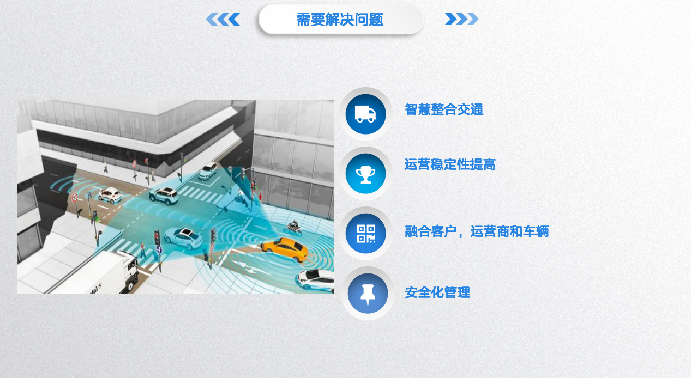
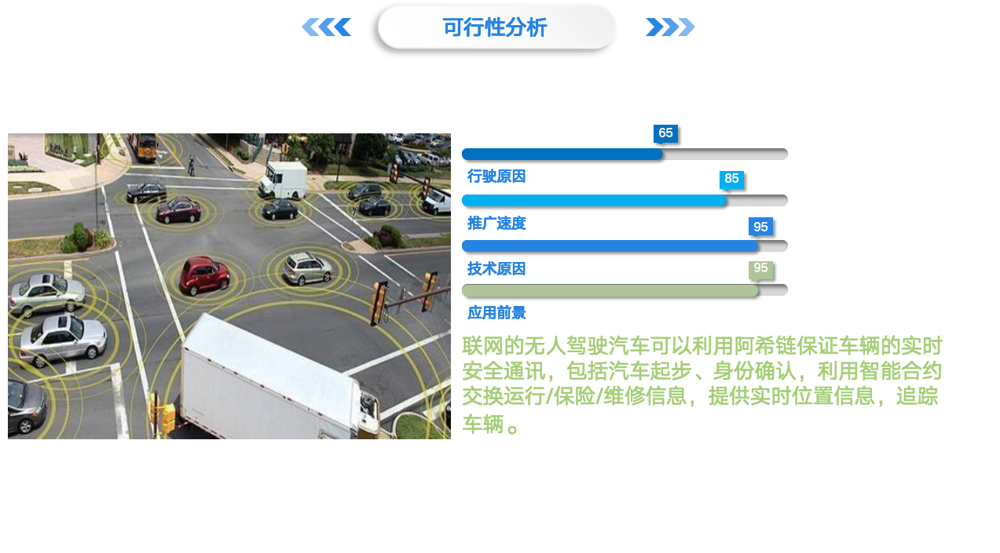
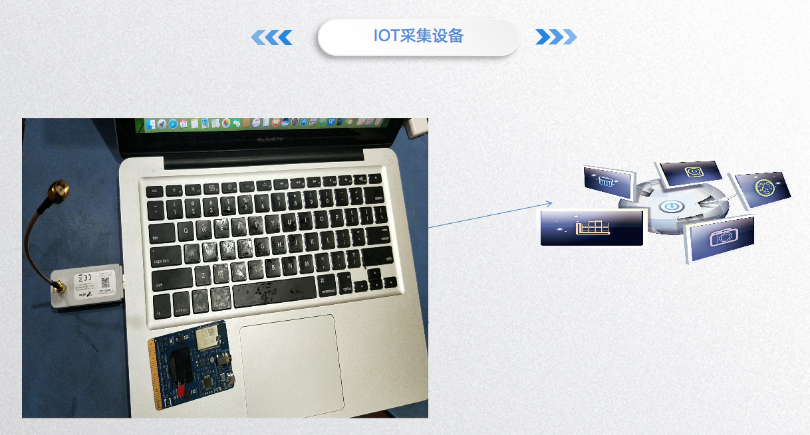
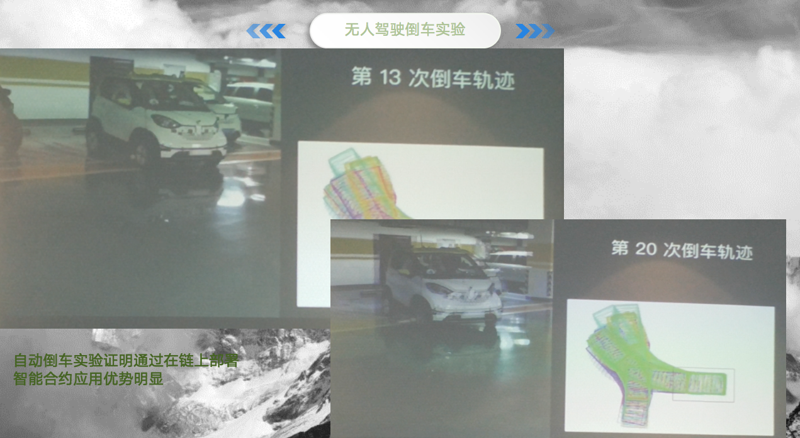

# Driveless
现在无人驾驶系统节点的中心化意味着无论汽车厂商还是出行服务商，都有可能在数据储存、数据使用、数据安全等方面承担极大的信用风险，但区块链分布式共识算法技术能够极大地消除中心化节点带来的风险；使用基于区块链区块链技术后，汽车上的应用和车辆间能够真实实现离线连接，数据不必经过第三方服务器，不再需要依赖一个中央系统来负责调配及存储所有的驾驶信息，省却了中心机构庞大的服务器运营成本；同时联网的无人驾驶汽车可以利用IOT设备采集数据上链，区块链上部署的智能合约保证车辆的实时安全通讯，包括汽车起步、身份确认，利用智能合约交换运行/保险/维修信息，提供实时位置信息，追踪车辆；同时在区块链上确保网络交易和服务数据的可信度，将车辆和客户的数据记录在透明性账本上，提供可信证明和可信计算。

智能合约部署无人驾驶车的IOT设备

 部署后的无人驾驶车倒车实验更安全更稳定

